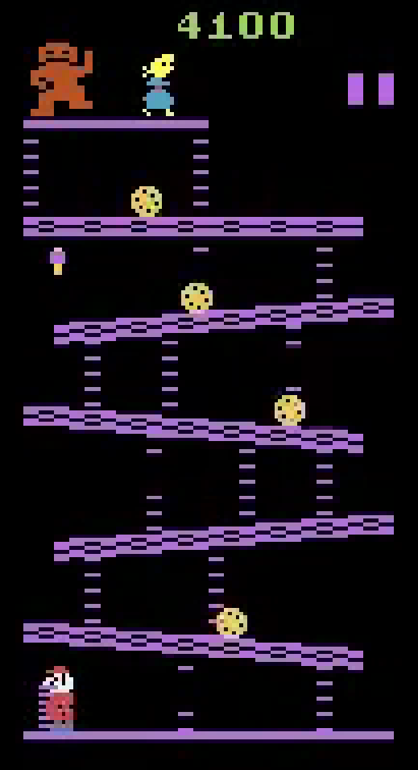

# Csci166-RL-DQN-Final-Project
Baseline vs Variant RL agents on Atari Classic Donkey Kong using DQN

# DQN on ALE_DonkeyKong-v5

## Gameplay Videos

## 🕹️ DQN Donkey Kong Agent Evaluation

### Baseline Agent (DQN)

| Episode   | Avg Reward | Preview | Video  |
|-----------|------------|---------|--------|
| Randomish | ~200       |  | <a href="https://bat4e.github.io/Csci166-RL-DQN-Final-Project/base_start-dk.mp4" target="_blank">▶ Watch</a> |
| MidPoint  | ~1200      |  | <a href="https://bat4e.github.io/Csci166-RL-DQN-Final-Project/base_mid-dk.mp4" target="_blank">▶ Watch</a> |
| Endpoint  | ~1650      |  | <a href="https://bat4e.github.io/Csci166-RL-DQN-Final-Project/base_end-dk.mp4" target="_blank">▶ Watch</a> |

### Variant Agent (Double + Dueling + PER)

| Episode        | Avg Reward              | Preview | Video  |
|----------------|-------------------------|---------|--------|
| Start/Midpoint | ~1400 (spikes to 2200)  |  | <a href="https://bat4e.github.io/Csci166-RL-DQN-Final-Project/variant_start-dk.mp4" target="_blank">▶ Watch</a> |
| End/Learned    | ~1300–1400 (volatile)   |  | <a href="https://bat4e.github.io/Csci166-RL-DQN-Final-Project/variant_end-dk.mp4" target="_blank">▶ Watch</a> |
